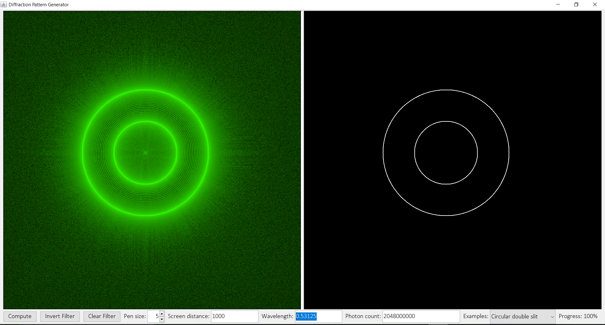
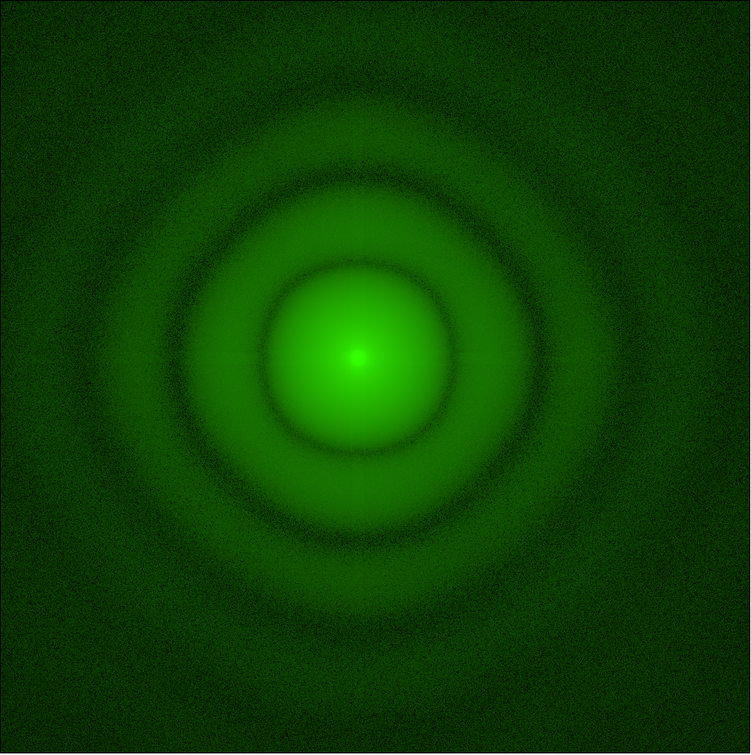
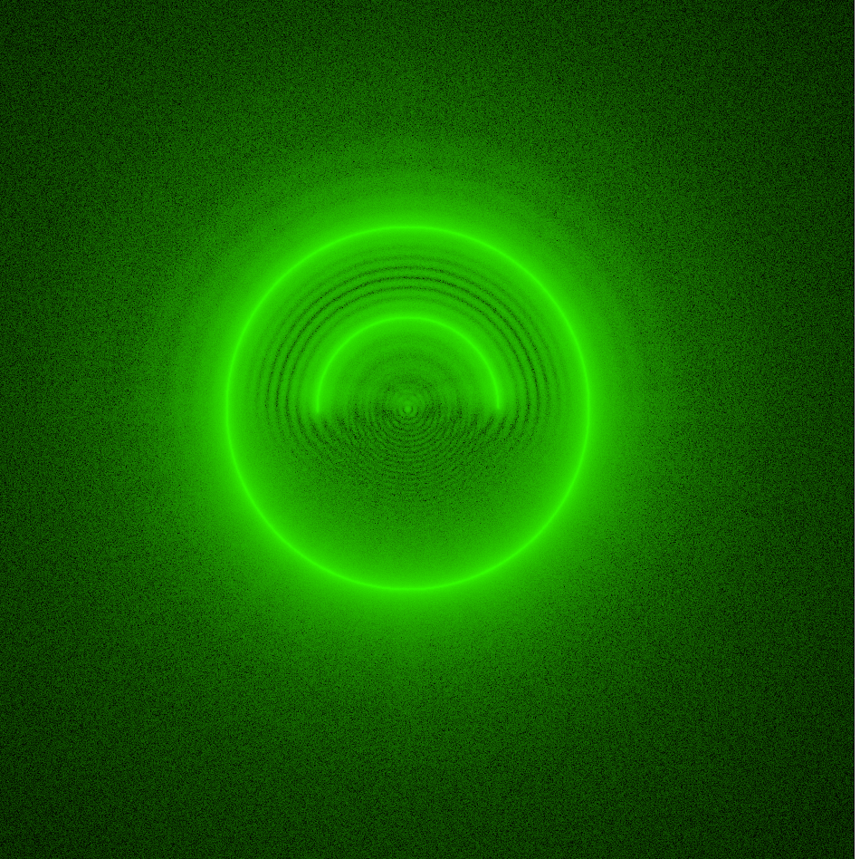
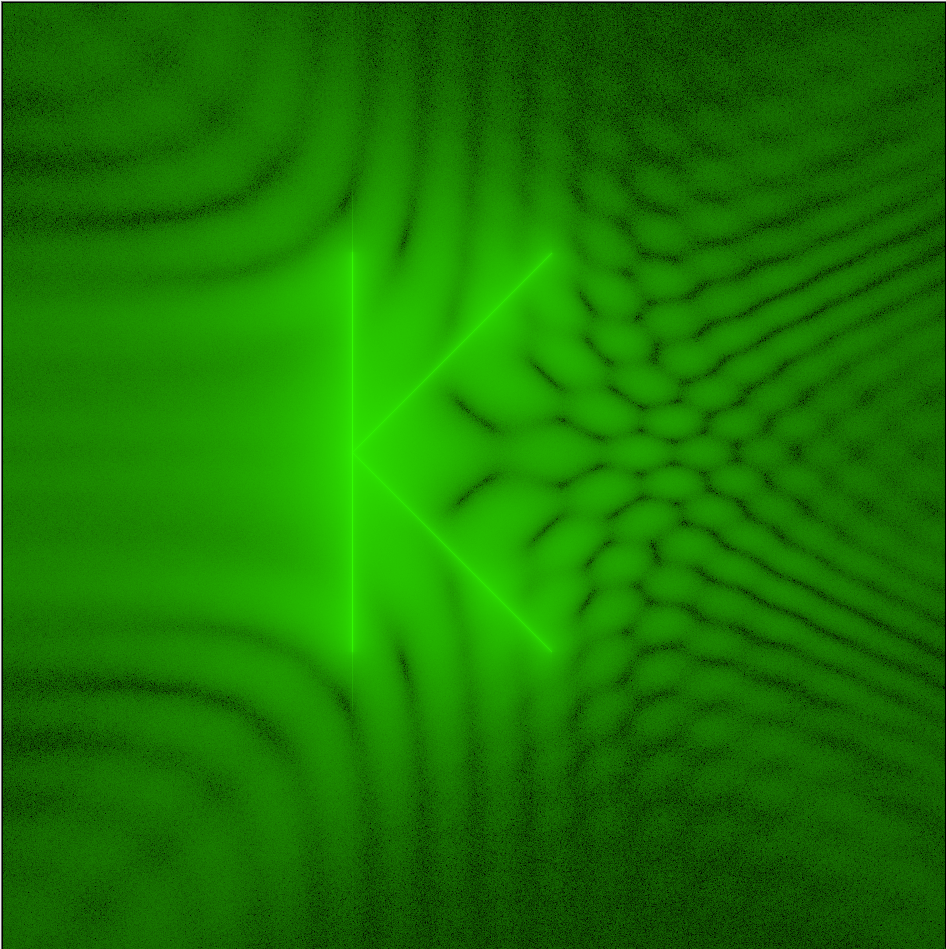
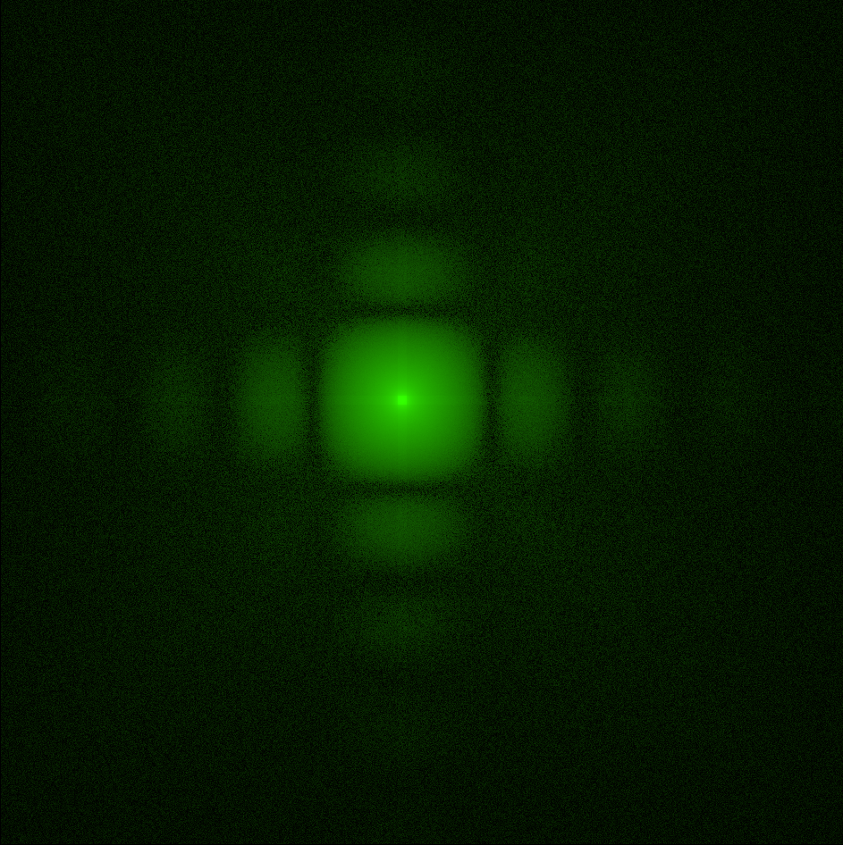
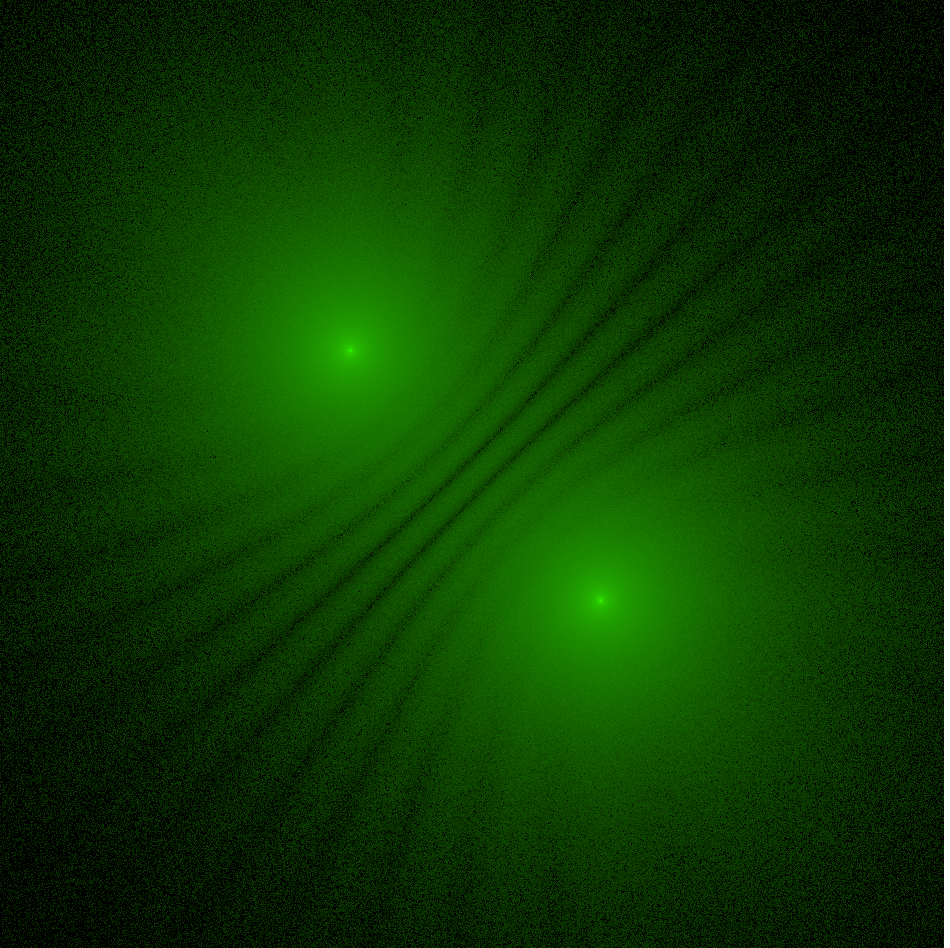

# Diffraction Pattern Visualizer

This is a tool to see what diffraction patterns look like. The tool includes:

- editing filters for different patterns by clicking and dragging on a canvas
- modifying properties such as wavelength
- template patterns such as double slits

## Getting Started

This is a Maven project using Java 16 (though it was originally written for Java 8). If Maven is installed, the project can be built by running the command `mvn clean install assembly:single`, which will create a runnable JAR file called "diffraction-pattern-0.0.1-SNAPSHOT-jar-with-dependencies.jar".

## Usage

When starting up, two blank screens will be displayed side-by-side. The one on the right is the canvas where a filter can be drawn by holding down the left mouse button and dragging. The filter will block light where it is colored black. Template filters can also be selected in the drop-down menu below the canvas. Pressing "Compute" will simulate the passage of photons through the filter and display the result on the left; more photons will generally yield smoother and more accurate output, though it will take longer to compute.

## Gallery

Screenshot of full application:

Several generated patterns:

